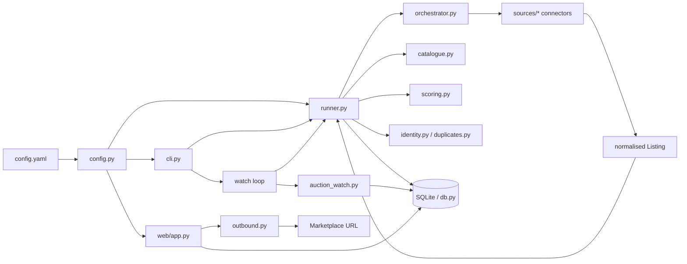
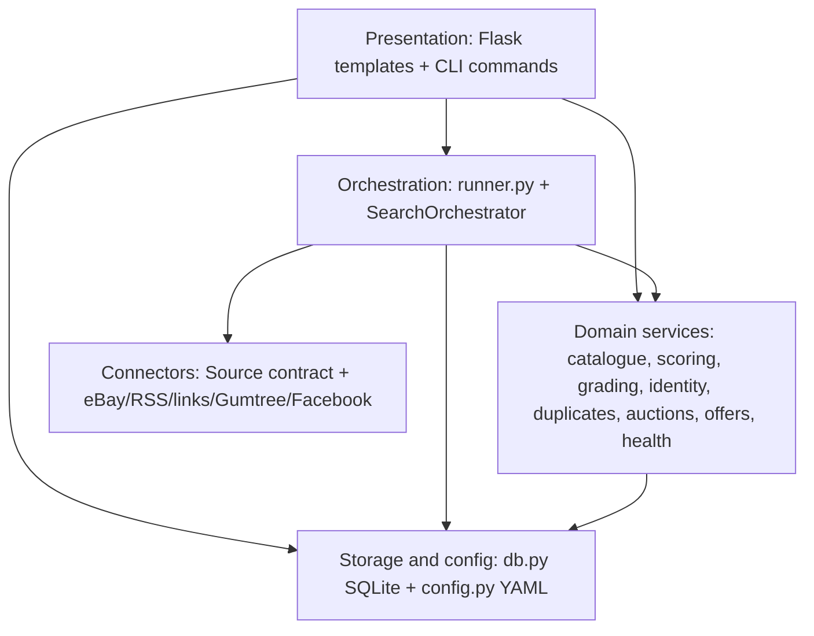
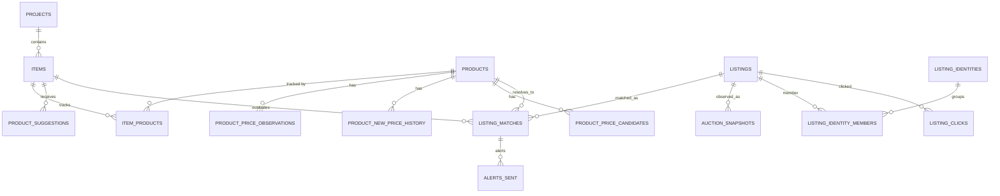
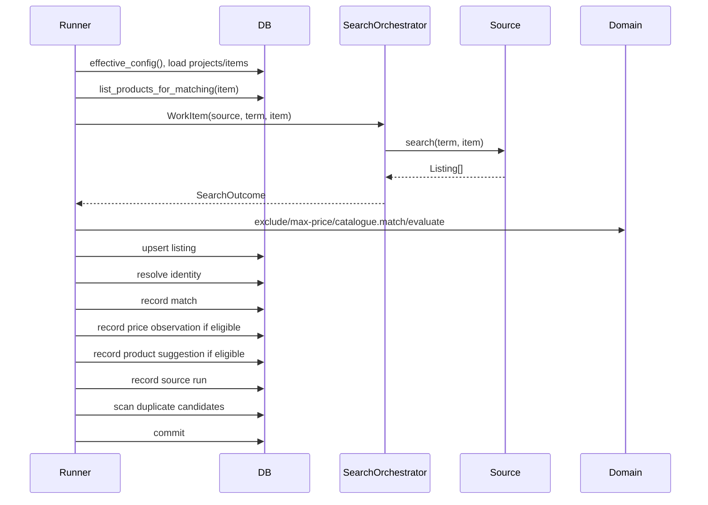
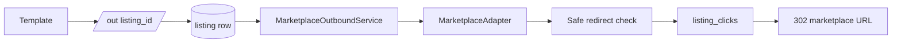

# Product Finder Architecture v2

---

Architecture Version: 1.0

- Status: Active
- Established: 2026-07-09
- Baseline Tag: architecture/v1

---

This is the canonical architecture reference for Product Finder.

It describes the platform as implemented today, not as originally planned. ADRs in `docs/adr/` remain historical decision records; when ADR prose disagrees with current implementation, implementation wins and the discrepancy is tracked in `docs/documentation-audit.md`.

## 1. System Purpose

Product Finder is a local-first market knowledge and buying-intelligence platform.

It watches marketplaces for listings that match a user's wanted items, then evaluates whether each listing is genuinely relevant, good value, current, trustworthy enough to consider, and worth acting on.

The system has moved beyond "bargain finder" into a platform that accumulates reusable knowledge about:

- connectors and source quality
- listings and listing state
- products and catalogue identity
- cross-source listing identity
- used and new market prices
- project-specific buying intent
- decision signals such as scores, warnings, auction trajectory, and offer suggestions

## 2. Current Runtime Architecture

Current state:

- Python package under `src/product_finder/`
- CLI entry point via `product-finder`
- Flask server-rendered web UI bound to localhost
- SQLite database with WAL mode and a 10 second busy timeout
- YAML configuration for global settings and source definitions
- DB-backed projects, items, catalogue, listings, matches, source settings, and telemetry
- `watch` and `web` run as independent OS processes against the same SQLite file

Search never runs inside a web request. The web app reads and mutates local state; the watch loop fetches marketplaces.

## 3. Architectural Layers

Layer rules:

- Connectors translate marketplace-specific access into normalised `Listing` or `ManualLink` objects.
- The orchestrator knows how search work is executed, not what a listing means.
- The runner owns the search cycle: fetch, filter, match, score, persist, alert.
- Domain modules should stay deterministic and source-agnostic.
- `db.py` owns schema, migrations, and persistence.
- Templates must not emit raw marketplace listing URLs directly; listing clicks go through the outbound gateway.

## 4. Major Components

| Component | Current responsibility |
|---|---|
| `config.py` | Loads YAML into dataclasses: sources, alerts, Ollama, SearXNG, outbound config, seed projects. |
| `db.py` | SQLite schema, migrations, CRUD, effective config overlays, query surfaces, telemetry, import/export support. |
| `cli.py` | Commands: `run-once`, `watch`, `import-config`, `list-projects`, `list-items`, `catalogue-tidy`, `web`. |
| `runner.py` | One full search cycle and alert dispatch. |
| `orchestrator.py` | Work item execution and `ExecutionPolicy` seam for future scheduling/retry/concurrency. |
| `sources/*` | Marketplace acquisition and manual link generation behind the `Source` contract. |
| `catalogue.py` | Product identity helpers, suggestion normalisation, product matching, accessory/suspect signals. |
| `scoring.py` | Margins, warning flags, objective deal score, under-target decision, spec-conflict penalties. |
| `grading.py` | Deterministic condition classification. |
| `spec_match.py` | Generic technical/category contradiction detection for unverified listings. |
| `identity.py` | Canonical URL identity v1, currently eBay item id extraction. |
| `duplicates.py` | Cross-marketplace fuzzy duplicate candidate generation for human review. |
| `auction_watch.py` | Auction polling and closing-price capture. |
| `auction_trajectory.py` | Explainable live-auction labels and bid-ceiling suggestions. |
| `offers.py` | Human-use offer suggestions; never submits offers. |
| `retailer_price.py` | Optional SearXNG-backed retailer price candidate discovery and approved URL refresh. |
| `extraction.py` | Optional Ollama brand/model extraction fallback feeding the suggestion queue. |
| `outbound.py` | Marketplace Outbound Gateway and affiliate/query-param adapter abstraction. |
| `connector_health.py` | Explainable source health classification over persisted telemetry. |
| `project_import.py` | Versioned JSON/YAML project-item import/export format. |

## 5. Current Domain Model

Important entities:

- **Project**: a group of wanted items and optional source restrictions.
- **Item**: project-scoped user intent: terms, exclude terms, max price, normal price, target price, priority, notes, source restrictions.
- **Product**: global platform catalogue identity and market fields: manufacturer, model, MSRP, typical new price, typical used price, canonical retailer URL, price trend fields.
- **ItemProduct**: item-specific tracking of a global product: match terms, target deal override, archived state, wanted/knowledge-only state.
- **Listing**: one marketplace listing, deduplicated by `(source, external_id)`.
- **ListingMatch**: one listing evaluated against one item, optionally resolved to a global product.
- **ProductSuggestion**: item-scoped candidate manufacturer/model discovered from structured source data or optional Ollama extraction.
- **ListingIdentity**: automatic canonical identity where a stable marketplace id is recoverable from URL.
- **ListingDuplicate**: human-reviewed possible cross-marketplace duplicate pair.
- **SourceRun**: per-source run telemetry used for health, maturity, and coverage analytics.
- **ListingClick**: outbound redirect audit event.

## 6. Data Ownership

Current state has no users or authentication. Ownership here means architectural ownership, not enforced authorization.

Platform-owned data:

- `listings`
- `products`
- `product_price_observations`
- `product_new_price_history`
- `product_price_candidates`
- `listing_identities`
- `listing_identity_members`
- `listing_duplicates`
- `auction_snapshots`
- `source_runs`
- `listing_clicks`
- source definitions from YAML

Project-owned data:

- `projects`
- `items`
- `item_products`
- `listing_matches`
- `alerts_sent`
- product suggestions as review candidates for an item's catalogue context

Future user-owned data:

- project owner id
- private project/item notes and preferences
- saved/ignored/shortlisted listing decisions
- project-scoped feedback such as wrong item, accessory, not relevant
- share/invite/clone state
- per-user alert preferences and recommendation preferences

The boundary is: products and listings are shared facts; matches and intent are project context.

## 7. Search Pipeline

`runner.run_once()` performs one cycle:

Current execution policy:

- sequential
- order-preserving
- zero retries by default
- no health-aware skipping yet
- no concurrency yet

Retry and policy seams exist; scheduling intelligence is future work.

## 8. Matching Pipeline

Matching has several layers:

1. **Source result filtering**: item exclude terms and max price.
2. **Catalogue match**: deterministic match terms over listing title, condition, and description. Longest matching term wins.
3. **Product verification**: a listing matched to an `ItemProduct` is treated as verified for scoring.
4. **Spec/category conflict detection**: unverified listings are checked for contradictions such as wrong component category, capacity, generation, or form factor.
5. **Identity resolution**:
   - canonical URL identity auto-links where a platform-native id can be derived
   - fuzzy duplicate candidates are proposed for human review only

Catalogue matching is deliberately narrow and explainable. It is a replaceable entry point, but the current implementation is deterministic.

## 9. Scoring Pipeline

`scoring.evaluate()` produces:

- condition grade
- warning flags
- absolute and percentage margin
- under-target boolean
- objective deal score

Inputs:

- listing price and text
- item prices and priority
- matched product reference prices
- typical used price
- used-price trend
- buying options
- technical/category conflicts

Important decisions:

- Item priority is not part of deal score. It belongs to future ranking/recommendation, not objective deal quality.
- Live auctions cannot be under-target and are excluded from best-deal hero surfaces.
- Multi-item/price-range listings cannot receive target bonus.
- Implausibly cheap unverified listings are treated as likely wrong-product matches.
- Verified catalogue matches are trusted over generic spec-conflict heuristics.
- Deal score remains heuristic and explainable, not a black-box recommendation.

## 10. Connector Architecture

Every connector implements `sources.base.Source`.

Connector classes:

- **Automated**: official API or legitimate feed/search source, returning normalised listings.
- **Manual-assisted**: generates pre-filtered links for a human to open.

Current built-in connectors:

- eBay: official Browse API, automated when credentials exist.
- Gumtree: manual-assisted links.
- Facebook Marketplace: manual-assisted links.
- RSS extra sources: automated config-defined feed parser.
- Link extra sources: manual-assisted config-defined URL template.

Connector declarations include:

- capabilities
- compliance basis
- account risk
- automation and manual-input flags
- freshness and scheduling guidance
- listing fields supplied
- enrichment support
- connector knowledge and maturity

Risk gating happens before scheduled execution: medium/high risk connectors require explicit `sources.risk_acknowledged`.

See `docs/connector-architecture.md` for the implementation guide.

## 11. Marketplace Outbound Gateway

Every listing click goes through `GET /out/<listing_id>`.

Rules:

- templates use `listing_out_url()`
- stored `listings.url` is never mutated for affiliate logic
- affiliate parameters are resolved server-side
- unsafe redirect destinations produce a 502 and a failure click record
- analytics writes must not block safe navigation
- manual-assisted search links and retailer price candidate URLs are not listing clicks

## 12. Catalogue Architecture

The catalogue is now globalised.

`products` stores shared product identity and market facts. `item_products` stores the item-specific tracking context.

This split enables:

- shared used-price observations across projects
- clone-by-reference in future sharing
- platform-owned catalogue quality
- per-item match terms and target thresholds
- knowledge-only products that still identify listings and collect price history but do not surface as deals

Product discovery paths:

- structured eBay brand/model enrichment
- optional Ollama free-text brand/model extraction
- human approval queue
- correction at approval time
- triage into strong/accessory/suspect/brand-only/needs-evidence buckets

Retailer price paths:

- optional SearXNG search for retailer price candidates
- human approval of canonical retailer URL
- deterministic refresh of approved URL

## 13. Import And Export

There are two import/export mechanisms:

- `import-config`: merges `config.yaml` projects/items into the DB for the original seed workflow.
- `project_import.py`: versioned `product-finder/import/v1` JSON/YAML format for previewed bulk import and export.

The versioned import/export format covers project and item intent. It does not export accumulated marketplace knowledge: listings, matches, product catalogue, source telemetry, price observations, auction snapshots, duplicate decisions, or clicks.

That is intentional. Project files are portable user intent, not database backups.

## 14. Extension Points

Current extension points:

- new connector: implement `Source`, or configure `sources.extra`
- new source risk model fields: extend `SourceCapabilities` only when consumed
- new connector prose/roadmap: implement `knowledge()`
- new search scheduling: implement `ExecutionPolicy`
- new outbound handling: implement `MarketplaceAdapter`, or configure `outbound.affiliate_params`
- new matching strategy: replace/wrap `catalogue.match()`
- new alert channel: add under `alerts/`, guarded by `alerts_sent`
- new import format: add schema version after `product-finder/import/v1`

Future integration points:

- authentication and ownership
- public search
- user decisions and feedback
- notifications
- browser extension
- API/webhooks
- mobile app
- community templates
- public catalogue

## 15. Current Limitations

Current state:

- no authentication or user ownership
- localhost-only Flask app
- no public search surface
- no subscriptions, billing, or public API
- no seller identity model
- no automated Gumtree/Facebook ingestion
- no perceptual image matching
- no automatic purchase, offer submission, or seller messaging
- no general data-retention/pruning policy for all historical rows
- no health-aware search scheduling yet
- no concurrency in search orchestration
- no moderation/audit model for shared global product edits
- no global merge audit trail

Deliberately deferred:

- scraping/user-session connectors by default
- public exposure without explicit route/data filtering
- recommendation intelligence before catalogue, identity, trust, and coverage mature

## 16. Roadmap Relationship

Product evolution is tracked in `docs/strategy/roadmap.md`.

The public/commercial readiness sequence is:

| Area | Status |
|---|---|
| Catalogue globalization | shipped |
| Marketplace Outbound Gateway / affiliate click tracking | shipped |
| Authentik/OIDC authentication | planned |
| User-owned data and authorization | planned |
| Public homepage/search | planned |
| Project sharing/invites/cloning | planned |

This roadmap must remain additive to the platform model. Commercial layers should consume platform knowledge; they should not redefine it.

## 17. Canonical Companion Documents

- `VISION.md`
- `docs/platform-charter.md`
- `docs/knowledge-model.md`
- `docs/platform-domain-model.md`
- `docs/connector-architecture.md`
- `docs/strategy/roadmap.md`
- `docs/documentation-audit.md`
- `docs/architecture-review.md`
- `docs/strategic-review.md`
