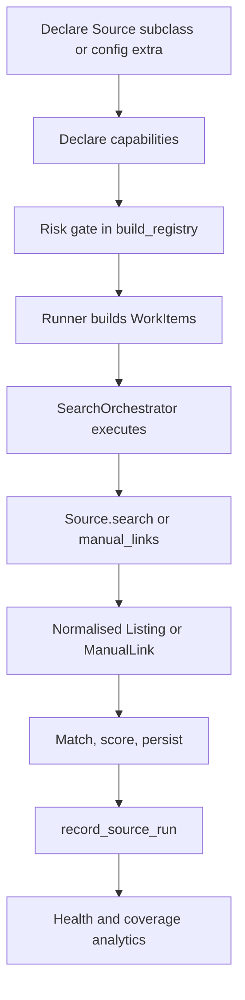

# Connector Architecture

This document is the implementation guide for current and future Product Finder connectors.

## Purpose

Connectors acquire marketplace or feed data and translate it into the platform's normalised shapes. They isolate source-specific access, compliance, quirks, rate limits, and enrichment from the rest of the engine.

The rest of Product Finder should reason over normalised listings, manual links, capabilities, health, and provenance, not marketplace-specific implementation detail.

## Current Connector Contract

Every connector implements `sources.base.Source`.

Core members:

- `name`
- `capabilities() -> SourceCapabilities`
- `knowledge() -> ConnectorKnowledge`
- `is_automated()`
- `search(term, item) -> list[Listing]`
- `manual_links(item) -> list[ManualLink]`
- `get_item_details(external_id) -> dict | None`

`capabilities()` is abstract and mandatory. `knowledge()` has a safe default for test fakes, but all real connectors override it.

## Connector Classes

### Automated Connectors

Automated connectors return `Listing` objects from `search()`.

Accepted bases:

- official APIs
- authorised feeds
- open RSS/Atom sources
- other legitimate programmatic sources

Current examples:

- eBay Browse API
- config-defined RSS feeds

### Manual-Assisted Connectors

Manual-assisted connectors return `ManualLink` objects from `manual_links()`.

They do not ingest listing data automatically. They help the user open a compliant pre-filtered search.

Current examples:

- Gumtree
- Facebook Marketplace
- config-defined link sources

## Connector Lifecycle

## Capabilities

`SourceCapabilities` is the machine-readable connector contract.

It declares:

- automated/manual shape
- compliance prose
- account risk
- compliance mode
- unattended capability
- user auth requirement
- manual input requirement
- official API/indexed/search/scraping/provider basis
- rate-limit class
- recommended schedule
- freshness
- listing fields provided
- enrichment support
- auction/offer/location/image/structured-attribute support

Design rule:

Add a capability field only when something consumes it. The capabilities model is not a wishlist.

## Connector Knowledge

`ConnectorKnowledge` is the human-readable connector reference.

It declares:

- display name
- description
- implementation type
- maturity
- supported listing types
- supported marketplaces
- supported search features
- known limitations
- planned work
- intentionally unsupported items
- investigation items

This is surfaced on the Sources page and should be authored close to the connector implementation.

## Compliance And Risk

Compliance is explicit architecture.

Supported compliance modes:

- `official`
- `indexed`
- `manual`
- `user_session`
- `scraping`
- `licensed_provider`

Risk levels:

- `none`
- `low`
- `medium`
- `high`

Rules:

- scraping cannot claim no/low risk
- user-session access cannot claim no risk
- medium/high risk connectors are excluded from scheduled runs unless named in `sources.risk_acknowledged`
- no connector should bypass logins, CAPTCHA, bot protection, or marketplace terms silently
- manual-assisted is a valid first-class connector class, not a failure to automate

## Search Orchestration

`runner.py` builds `WorkItem` objects for eligible automated connectors and search terms.

`SearchOrchestrator` executes them through an `ExecutionPolicy`.

Current default behaviour:

- select all
- preserve order
- run sequentially
- zero retries
- no health data passed in

Implemented seam:

- connector selection
- ordering
- retry count
- retry backoff
- declared concurrency

Not yet implemented:

- actual concurrent execution
- health-aware skipping in the default run
- distributed workers
- global cross-connector rate-limit coordination

Future scheduling should be an `ExecutionPolicy`, not ad hoc logic in `runner.py`.

## Coverage And Health

Each run records `source_runs`.

Current telemetry includes:

- searches
- listings returned
- errors
- last error
- duration
- new listings
- duplicates
- catalogue matches
- deals found

Health is rule-based and explainable via `connector_health.py`.

Coverage analytics answer questions such as:

- how many listings a source contributes
- how many are live or stale
- catalogue match rate
- duplicate suppression
- price-history contribution
- recent vs baseline performance

Gaps are documented rather than faked. For example, parse/schema failure type is not currently distinguishable from generic network/auth errors.

## Marketplace Abstraction

Connectors are inbound marketplace adapters.

The outbound side is separate:

- inbound acquisition: `Source`
- outbound navigation: `MarketplaceAdapter`

A marketplace can need both, but they are not the same responsibility. A source fetches listings; an outbound adapter resolves listing clicks and affiliate parameters.

## Current Connector Inventory

| Connector | Class | Compliance | Automation | Maturity |
|---|---|---|---|---|
| eBay | Built-in API connector | official Browse API | automated when credentials exist | production |
| Gumtree | Built-in link connector | manual | manual-assisted | production |
| Facebook Marketplace | Built-in link connector | manual | manual-assisted | production |
| RSS extras | Config-defined feed connector | indexed/open feed | automated | beta |
| Link extras | Config-defined URL templates | manual | manual-assisted | production mechanism |

## Adding A Connector

1. Confirm legitimate access route and compliance mode.
2. Decide whether it is automated or manual-assisted.
3. If RSS/feed or simple link, prefer `sources.extra` configuration.
4. If code is needed, implement `Source`.
5. Declare `SourceCapabilities`.
6. Declare `ConnectorKnowledge`.
7. Ensure output is normalised `Listing` or `ManualLink`.
8. Add tests for parsing, capability declarations, risk behaviour, and registry inclusion.
9. Ensure failures are caught per source/term and recorded as source telemetry.
10. Avoid downstream source-specific branches.

## Extension Model

Future connectors should plug into:

- `Source.search()` for automated listing acquisition
- `Source.manual_links()` for manual-assisted sources
- `Source.get_item_details()` for structured enrichment
- `SourceCapabilities` for operational decisions
- `ConnectorKnowledge` for human-facing source documentation
- `ExecutionPolicy` for scheduling behaviour
- `MarketplaceAdapter` for outbound click/affiliate behaviour

## Deliberately Deferred

- browser/user-session connector as core architecture
- scheduled high-risk scraping by default
- marketplace-specific downstream scoring
- connector-specific dashboard query paths
- adding seller identity fields before a consumer exists
- concurrency before thread-safety and database write boundaries are designed
