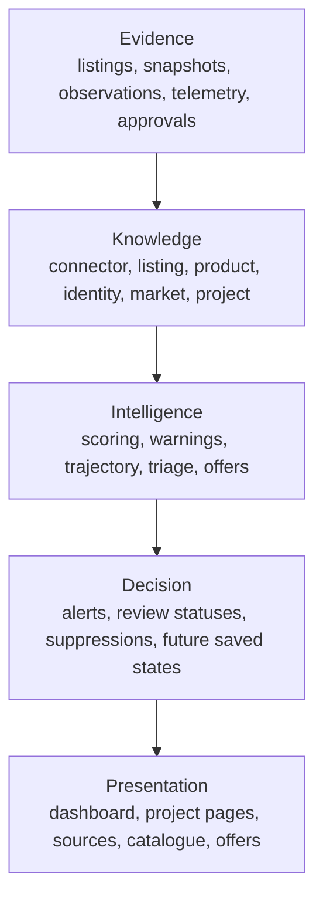
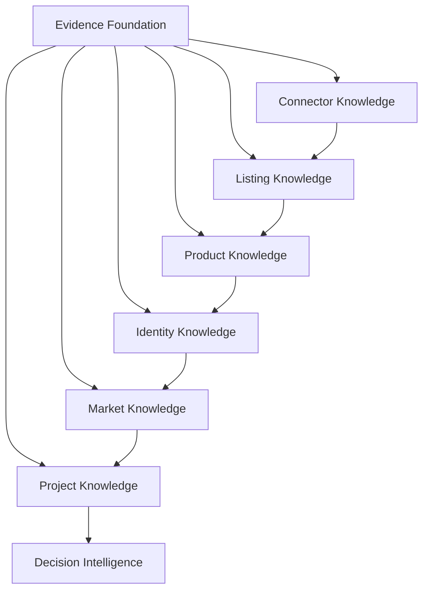

# Product Finder Knowledge Model

---

Architecture Version: 1.0

- Status: Active
- Established: 2026-07-09
- Baseline Tag: architecture/v1

---

This document is the intellectual centre of Product Finder.

The platform's long-term value is the knowledge it compounds while watching markets. Every future feature should enrich one or more of these layers, or protect their quality.

## Evidence Flow

Product Finder's knowledge starts as evidence, not assertion.

Evidence is any persisted observation, declaration, review decision, or telemetry record that can support later reasoning. In the current implementation this includes listings, auction snapshots, price observations, retailer price candidates, duplicate reviews, connector telemetry, source capability declarations, outbound click records, and human approvals or dismissals.

Knowledge emerges when evidence is normalised, accumulated, linked, and made reusable. Intelligence is the rule-based evaluation of that knowledge in a project context. Decisions are durable human or system outcomes such as alerts, review statuses, suppressions, saved/ignored states, and future recommendations. Presentation is how those decisions and their evidence are exposed to a user.

This is a description of the implementation, not a separate abstraction to build. Existing tables and review workflows already follow this pattern: uncertain inputs are retained with provenance, accumulated into knowledge, evaluated by explainable rules, and surfaced without pretending uncertainty has disappeared.

## Knowledge Layers

The layers are not strictly linear in implementation, but they form a dependency chain for trust. A recommendation is only as good as the connector, listing, product, identity, market, and project evidence underneath it.

## 1. Connector Knowledge

Ownership:

Platform-owned.

Current inputs:

- `SourceCapabilities`
- `ConnectorKnowledge`
- `source_runs`
- source coverage and coverage analytics queries
- operator configuration
- risk acknowledgement settings

Current outputs:

- connector class and maturity
- compliance basis
- account risk
- freshness and rate-limit guidance
- health status
- coverage and yield metrics
- known limitations and planned work

Consumers:

- runner and registry
- Sources page
- connector health module
- future scheduling policy
- architecture and compliance decisions

Responsibilities:

- describe how a source may be used
- prevent hidden risk
- expose quality and reliability
- keep marketplace-specific acquisition behaviour isolated

Future evolution:

- health-aware execution policies
- per-connector cadence and backoff
- richer seller/identity capabilities
- exception classification
- source-level trust scoring
- connector marketplace coverage maps

## 2. Listing Knowledge

Ownership:

Platform-owned.

Current inputs:

- normalised `Listing` objects from connectors
- eBay detail lookups
- RSS/feed parsing
- auction snapshots
- listing rescan updates

Current outputs:

- `listings`
- `auction_snapshots`
- buying options
- current bid and Buy It Now fields
- image URL
- listing end time
- description and condition text
- observed listing freshness

Consumers:

- scoring
- grading
- catalogue matching
- spec conflict detection
- identity and duplicate detection
- web dashboard/project pages
- auction and offer pages

Responsibilities:

- preserve source provenance
- represent a marketplace listing once per `(source, external_id)`
- provide stable input for downstream evaluation
- retain evidence even when a listing is hidden from deal surfaces

Future evolution:

- seller identity fields
- richer location semantics
- listing lifecycle and stale-pruning policy
- image provenance and perceptual image matching
- structured attributes beyond brand/model
- public-safe listing views

## 3. Product Knowledge

Ownership:

Platform-owned for product identity and market facts; project-owned for item-specific tracking context.

Current inputs:

- human-created catalogue products
- structured eBay brand/model details
- optional Ollama extraction results
- human approval/correction
- product merge/dedupe tools
- retailer price candidates

Current outputs:

- global `products`
- item-specific `item_products`
- `product_suggestions`
- suspect/accessory/product triage signals
- match terms
- MSRP and typical new price
- typical used price
- canonical retailer URL

Consumers:

- catalogue matching
- scoring
- price observations
- retailer price discovery
- project/item UI
- future public catalogue

Responsibilities:

- identify what product a listing describes
- separate complete products from accessories, spares, bundles, and unwanted variants
- preserve global product facts separately from project intent
- provide verified reference prices

Future evolution:

- richer product attributes
- category taxonomy
- variant relationships
- compatibility
- alternatives and substitutes
- bundle decomposition
- moderation/audit for global product edits

## 4. Identity Knowledge

Ownership:

Platform-owned, with human-reviewed decisions where confidence is not provable.

Current inputs:

- listing URLs
- source/native ids
- title, price, source, location, image URL
- human duplicate decisions
- catalogue product identity keys

Current outputs:

- `listing_identities`
- `listing_identity_members`
- `listing_duplicates`
- `is_primary_sighting`
- global product dedupe by manufacturer/model key

Consumers:

- alert suppression
- dashboard/project queries
- price observation gating
- duplicate review UI
- future public search

Responsibilities:

- avoid showing the same opportunity repeatedly
- preserve provenance instead of deleting sightings
- separate provable identity from probable duplicates
- prevent accidental auto-merges where evidence is weak

Future evolution:

- seller identity evidence
- perceptual image hashing
- cross-marketplace relist detection
- group-level duplicate model if pairs stop being enough
- automatic resurfacing when a kept duplicate ends
- audit log for global product merges

## 5. Market Knowledge

Ownership:

Platform-owned.

Current inputs:

- asking-price observations from first-seen verified product matches
- auction close observations
- retailer price candidate approval and refresh
- source coverage/health metrics
- used-price trend calculation

Current outputs:

- `product_price_observations`
- `product_new_price_history`
- `product_price_candidates`
- `typical_used_price`
- `typical_new_price`
- `price_trend_pct`
- `price_trend_confidence`
- source coverage and analytics

Consumers:

- scoring
- auction trajectory
- offer suggestions
- catalogue/product UI
- future market intelligence and forecasting

Responsibilities:

- estimate what products cost new and used
- distinguish asking prices from stronger sold/close-price evidence
- expose confidence and evidence quality
- measure source contribution and freshness

Future evolution:

- sold-price integrations where legitimately available
- new-price history trend scoring
- market volatility and seasonality
- confidence intervals
- demand/supply indicators
- seller and marketplace trust overlays

## 6. Project Knowledge

Ownership:

Project-owned now; user-owned in the future through project ownership.

Current inputs:

- projects
- items
- item search terms and exclude terms
- item normal/target/max prices
- priority
- notes
- project and item source restrictions
- `item_products`
- import/export documents

Current outputs:

- active watch configuration
- eligible sources per item
- manual search links
- project dashboards
- listing matches scoped to user intent

Consumers:

- runner
- scoring
- web UI
- import/export
- future ownership and sharing layers

Responsibilities:

- express user intent
- narrow the market to what matters
- decide which global products are wanted, knowledge-only, or archived for this item
- provide context for matching and scoring

Future evolution:

- user ownership
- project templates
- project sharing and cloning
- personal preferences
- per-project notification policies
- compatibility profiles

## 7. Decision Intelligence

This layer is called intelligence rather than knowledge because it primarily evaluates accumulated evidence in context. A deal score, auction label, offer suggestion, or warning surface is not a new market fact by itself; it is an explainable judgement over connector, listing, product, identity, market, and project knowledge.

Ownership:

Mixed. Current computed decisions are project/item scoped; future explicit decisions should be user/project owned.

Current inputs:

- listing match evaluations
- warning flags
- deal score
- auction trajectory labels
- offer suggestions
- duplicate review decisions
- product suggestion approvals/dismissals
- knowledge-only/archive decisions
- outbound clicks

Current outputs:

- `listing_matches`
- `alerts_sent`
- duplicate statuses
- suggestion statuses
- click audit rows
- dashboard best-deal surfaces
- warning tables

Consumers:

- user-facing UI
- alerts
- future recommendations
- future analytics

Responsibilities:

- explain what is worth attention
- prevent repeat alerts
- keep human decisions durable
- separate objective quality from personal importance
- avoid acting automatically on uncertain conclusions

Future evolution:

- saved/ignored/shortlisted decisions
- wrong-item/accessory feedback
- recommendation explanations
- buy/wait/alternative advice
- notification prioritisation
- anonymous click analytics and signed-in attribution

## Design Rule

If a feature does not enrich or consume one of these layers, it is probably outside Product Finder's core architecture.
