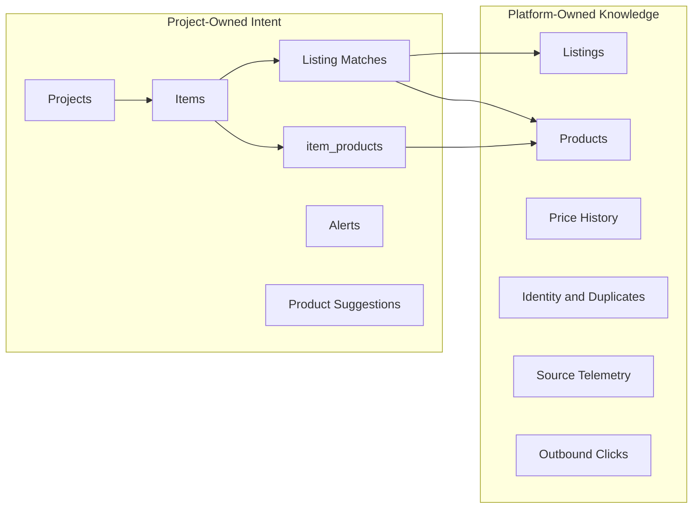

# Platform Domain Model

This document defines Product Finder's canonical ownership model.

It reconciles the implementation with ADR-0004 and ADR-0007. ADR-0004 established the intended ownership boundary. ADR-0007 corrected the catalogue schema so the implementation now matches that boundary for products.

## Current State

There are no users or authentication in the current app.

The current app is still a local, single-operator tool, but the schema already distinguishes platform-owned market knowledge from project-owned user intent.

## Ownership Summary

## Platform-Owned Entities

These represent market facts, shared evidence, or platform telemetry.

### `listings`

A marketplace listing is stored once per `(source, external_id)`.

Rationale:

The same listing can match many items. Duplicating it per item would fragment provenance and identity.

### `products`

A product is a global manufacturer/model catalogue entry.

Current fields are product identity and market facts: manufacturer, model, MSRP, typical new price, typical used price, canonical retailer URL, price-search status, and trend fields.

Rationale:

Two projects tracking the same Makita, GPU, or monitor should share the same product and price history. This is the central correction from ADR-0007 and EPIC-100.

### `product_price_observations`

Used-price evidence for a global product.

Rationale:

Every verified sighting should improve the shared product's used-price estimate.

### `product_new_price_history` and `product_price_candidates`

Retailer price evidence and human-reviewable candidates for the global product.

Rationale:

New-price knowledge describes the product, not a user's project.

### `listing_identities` and `listing_identity_members`

Automatic canonical identity groups where a stable source-native id can be recovered.

Rationale:

This is a property of listings and their provenance, not user intent.

### `listing_duplicates`

Human-reviewed probable cross-marketplace duplicate pairs.

Rationale:

Duplicate suppression protects the market view. The current table includes `item_id` as detection/review context, but the duplicate relationship itself is about listings.

### `auction_snapshots`

Append-only auction observation history.

Rationale:

Auction bid movement and close observations are marketplace facts.

### `source_runs`

Connector telemetry.

Rationale:

Source health, coverage, and reliability describe the platform's acquisition layer.

### `listing_clicks`

Outbound redirect audit events.

Rationale:

Clicks are platform telemetry. `user_id` is reserved for future attribution but currently always null.

## Project-Owned Entities

These represent what someone wants and how platform knowledge is interpreted for that intent.

### `projects`

A project groups wanted items and optional source restrictions.

Future user ownership will attach at the project row, not every child row.

### `items`

An item describes a wanted product or class of product within a project.

It owns:

- search terms
- exclude terms
- max price
- normal price fallback
- target deal price fallback
- priority
- notes
- source restrictions

### `item_products`

The join between an item and a global product.

It owns item-specific context:

- match terms
- target deal override
- archived state for this item
- wanted vs knowledge-only state for this item

Rationale:

The same global product may be wanted in one project, knowledge-only in another, and matched by different terms in each.

### `listing_matches`

The evaluation of one listing against one item.

Rationale:

A listing can be relevant to multiple items for different reasons. The match is project/item context, not a property of the listing alone.

### `alerts_sent`

Per-match alert delivery state.

Rationale:

Alerts answer "has this item/project already been told about this match on this channel?"

### `product_suggestions`

Candidate products discovered for an item.

Rationale:

Suggestion evidence may eventually create or attach a global product, but the review queue is item-contextual: it asks whether this candidate belongs in this item's catalogue.

## Future User-Owned Entities

Not implemented today.

Planned or implied by ADRs and roadmap:

- `users`
- `projects.owner_user_id`
- project-scoped listing decisions: saved, ignored, shortlisted
- feedback: wrong item, accessory, not relevant
- notification preferences
- private recommendation preferences
- project invites
- project clones
- per-user click attribution
- public vs signed-in session state

## Rationale For The Boundary

The architecture relies on a simple rule:

Market knowledge is shared; intent and decisions are contextual.

This avoids two failure modes:

- fragmenting evidence by duplicating the same product/listing per project
- leaking personal intent by treating matches, notes, and decisions as global facts

## Current Inconsistencies To Be Aware Of

ADR-0004 still contains historical prose saying the products schema was item-scoped. That was true when the ADR was written, but it is no longer true.

ADR-0007 is still marked "Proposed" and "planning only", but EPIC-100 shipped. The implementation and backlog are authoritative for current state.

The live database may contain a harmless leftover `products.wanted` column from the migration incident documented in implementation notes. Current code treats `item_products.wanted` as authoritative.

## Future Direction

When authentication lands, ownership should attach to `projects`.

Do not add `user_id` to platform-owned market facts unless a real privacy, attribution, or moderation requirement proves it necessary. User data should reference shared facts, not own them.
