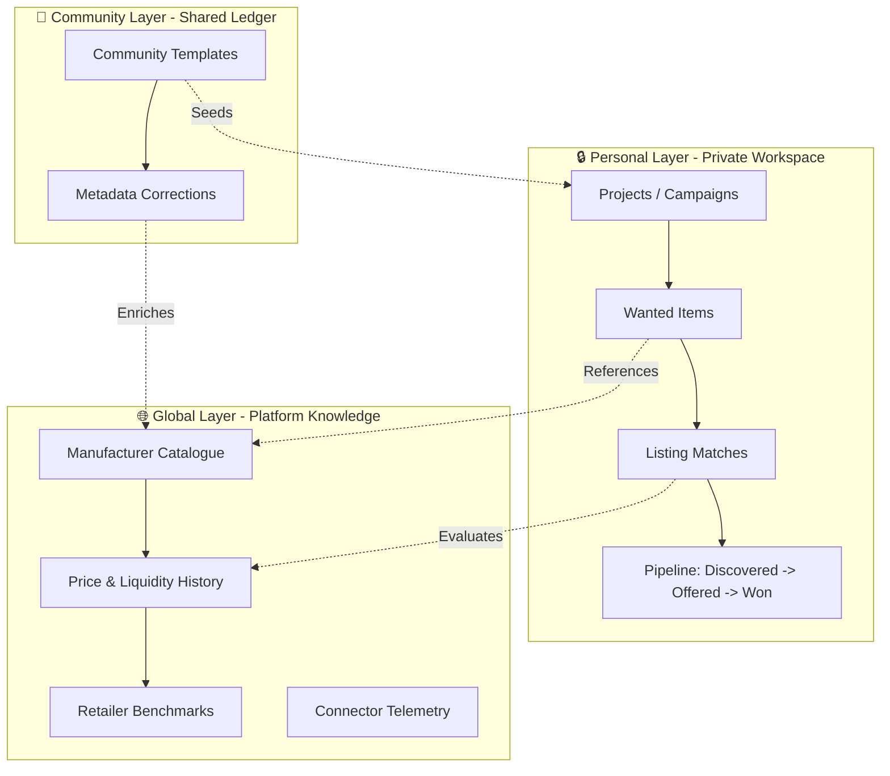

# Platform User Experience & Product Design Review
**Project:** Product Finder  
**Author:** Principal User Experience Architect (Antigravity)  
**Date:** July 2026  
**Kernel Compatibility:** v0.6.8+  

---

## 1. Guiding User Experience Principles

This document serves as the long-term UX philosophy and design system reference for Product Finder. All future design, engineering, and agent-based implementation decisions must align with these core principles:

* **Evidence Before Opinion:** The interface must present observed facts (provenance, listings, raw transaction data) before computed inferences or predictions.
* **Explainability Over Mystery:** Every deal score, notification trigger, and mismatch warning must display the exact rules, observations, and logic that computed it.
* **Calm Authority Over Visual Noise:** Design for long-term concentration. Avoid decorative animations, flashing colors, or consumer-oriented gradients. High information density must be structured through clear grids, borders, and visual hierarchy.
* **Human Judgement Over Autonomous Action:** The system proposes metadata changes, duplicate resolutions, and classifications. The human confirms or rejects. The database remains clean because the user holds the final pen.
* **Shared Knowledge, Private Intent:** Maintain a strict boundary between public, global market facts (the catalogue) and private user goals (projects, targets, and notes).
* **Speed Without Sacrificing Trust:** Optimize interactions for keyboard-driven efficiency and fast page loading, but never hide underlying data details to make a interface look simpler.

---

## 2. Executive Summary

Product Finder is at a critical inflection point. Having successfully transitioned its data architecture from an item-centric model to a global, evidence-backed product catalogue (as established in `ADR-0007` and `EPIC-100`), the platform is now technically capable of scaling. However, the user experience remains that of a local, command-line-adjacent developer utility.

This review provides a blueprint for evolving Product Finder over the next 2–3 years into a **premium, commercial-grade Market Intelligence and Procurement platform**. 

### Key Recommendations:
1. **Enforce Absolute Affiliate Isolation:** Affiliate attribution must be completely separated from ranking, scoring, and recommendations. The platform's recommendations must remain strictly unbiased.
2. **Prioritize Evidence-First AI:** Eliminate speculative AI price forecasting. AI must focus on explaining historical facts, classifying current listings, and suggesting structural relationships.
3. **Expose the Three Knowledge Layers:** Clearly demarcate **Personal**, **Community**, and **Global** knowledge boundaries within the user interface.
4. **Make Time a First-Class Citizen:** Integrate discovery timelines, listing lifecycles, and trend updates dynamically across all dashboards.
5. **Optimize for Calm Authority:** Replace consumer-oriented design styles (like glassmorphism) with a high-density, calm, and structured interface resembling professional engineering and productivity tools.

---

## 3. Overall UX Assessment

Currently, Product Finder is a **high-utility, low-fidelity** application. 

The underlying technical decisions (explainable scoring, split catalogue structure, outbound click tracking) are architecturally mature. However, the user-facing interface does not match this sophistication. It suffers from **navigation fragmentation** (forcing users to jump between pages to resolve duplicates, check source health, and review listings) and **low information density**, which increases the time-to-decision for power users.

To transition to a commercial SaaS platform, the UX must scale from showing *what matched* to helping the user decide *whether to act, wait, or negotiate*, anchored in historical evidence and clear boundaries of ownership.

---

## 4. Current Strengths

* **The Global Catalogue Split (`products` vs `item_products`):** Separating global manufacturer data from project intent is a brilliant architectural foundation. It ensures the user never has to re-enter metadata or redefine market prices when starting a new project.
* **Explainable and Rule-Based Scoring:** The deal score is not a black box. The UI explicitly states *why* a listing scored highly (e.g., "15% under typical used price, trusted seller").
* **Human-in-the-Loop Architecture:** The integration of triage queues for suggestions, duplicates, and pricing candidates prevents the platform from polluting its database with poor automated choices.
* **Normalised Listing Schema:** Connecting multiple distinct marketplaces to a single, consistent listing detail view prevents downstream UI fragmentation.

---

## 5. Current Weaknesses

* **Fragmented Attention & Triage Fatigue:** Reviewing matched listings requires clicking through multiple detail pages. There is no unified workspace for high-velocity triage (e.g., "Save, Ignore, flag as Accessory").
* **Implicit Knowledge Boundaries:** Personal project data, community-contributed corrections, and global marketplace facts are presented on the same level, raising concerns about data privacy and attribution.
* **Temporal Blindness:** The interface does not highlight listing updates, connector search runs, or price fluctuations over time, making the market feel static.
* **Invisible Trust Provenance:** While warning flags exist, the provenance of used-price observations and connector health is not visually aggregated, forcing the user to trust the system's conclusions blindly.

---

## 6. Recommended Information Architecture & Workspace Evolution

The mature platform's Information Architecture (IA) must respect the canonical boundary: **Market Knowledge is shared; User Intent is contextual.** 

The interface should clearly partition information into three distinct knowledge layers:
1. `🔒 Personal (Private)`: Owned strictly by the user/team (Projects, Budgets, Exclude Terms, Active Matches, Notes).
2. `👥 Community (Shared)`: Contributed by users (Project Templates, Verified Matches, Metadata corrections).
3. `🌐 Global (Canonical)`: Managed by the platform (Catalogue, Manufacturer Specs, Historical price observations, Connector health).

### Analysis of Workspace Evolution
As personal users evolve into teams, organizations, and businesses, introducing a **Workspace** concept above Projects is the correct architectural and UX progression.
* **The Hierarchy:** `Workspace ➔ Projects ➔ Items ➔ Products ➔ Listings`
* **UX Impact:**
  * *Hobbyists:* Assigned to a single default "Personal Workspace" automatically at sign-up. The extra hierarchy layer is completely invisible, keeping their setup simple.
  * *Teams / Enterprises:* A Workspace provides a clean boundary for shared billing, user access controls (Admin, Buyer, Observer), shared templates, and unified connector rate-limit configuration.
  * *Data Isolation:* Project data stays isolated to the workspace, while catalogue improvements contribute to the global database, ensuring scaling compatibility.

---

## 7. Recommended Navigation Structure

A professional platform requires a navigation system that supports deep focus, quick context switching, and high-efficiency workflows. We reject the concept of a global "Deals Feed" navigation item: deals do not exist in a vacuum, but only relative to a user's specific project intent.

### Primary Navigation (Collapsible Left Sidebar)

* **Dashboard (Hub):** Combined view of active projects, system notifications, and pending operational tasks.
* **Projects (Workspace - `🔒 Personal`):** Access to private projects, wanted items, and custom sourcing pipelines.
* **Marketplace (Knowledge - `🌐 Global`):** The shared product catalogue, brand specifications, historical pricing logs, and compatibility trees.
* **Operations (Maintainability - `👥 Community` / `🌐 Global`):** The admin and maintenance center of the platform.
* **Automation (Configuration - `🌐 Global`):** Connector scheduling, rate limiting, and alert webhook routing.
* **Settings (System & Profile):** User credentials, team invites, and compliance settings.

---

## 8. Operational Experience & Maintainability

The Triage Center must be expanded into a comprehensive **Operations** workspace. Product Finder is a system that grows in value as its underlying knowledge base improves. The UX must support the daily operational work of maintaining this ledger:

* **AI Suggestion Inbox:** Reviewing, correcting, and committing structural metadata (brand, model, specs) extracted by LLMs from unstructured listings.
* **Duplicate Matching Queue:** Reviewing and confirming cross-marketplace listing duplicate proposals.
* **Community Contributions:** Moderating and merging templates, category structures, or product compatibility guidelines contributed by users.
* **Connector & Scraper Telemetry:** Real-time visibility into source health, success rates, rate-limit consumption, and IP rotations.
* **Import/Export Auditing:** Monitoring file imports, failed schemas, and data reload events.

---

## 9. Earned Trust in the Interface

Trust is not established through marketing, visual polish, or branding statements. Trust is earned through the transparency, explainability, and traceability of the interface itself:

* **Uncertainty Disclosure:** The system must never pretend certainty. If a used price estimate is calculated from only three listings, the UI must explicitly display: `Confidence: Low (based on 3 observations)`.
* **Traceable Provenance:** Every price chart coordinate and catalogue specification must link back to its raw source listing or manufacturer page. Clicking a point on a trend line must reveal the listings that generated it.
* **Connector Health Signals:** Expose connector health indicators in context. A listing match should display when the marketplace was last crawled (e.g., `Gumtree | Last crawled 12m ago`).
* **Scoring Explanations:** Every deal score must be accompanied by an explainability dropdown detailing the calculation breakdown:
  * `Deal Score: 82`
  * `+15: Pricing is 20% below typical used average ($120 vs $150)`
  * `+10: Seller has 98%+ rating on eBay`
  * `-3: Connector risk is Medium (Gumtree RSS feed, manual shipping validation required)`

---

## 10. Time as a First-Class Citizen

Product Finder is a ledger of market change rather than a static database. The user experience must represent this temporal dimension across all interfaces:

* **Discovery Timelines:** Match streams must prioritize discovery age (`Found 2m ago`) rather than absolute posting date, reflecting crawl cycles.
* **Price Movements:** Display active price changes on listings directly (e.g., `-$30 since Monday` or `Price dropped 12%`).
* **Listing Lifecycle States:**
  * *Auctions Ending:* Auction matches must display live countdowns that transition from grey to amber/red as the close of the listing approaches (`Closes in 4m`).
  * *Stale Listings:* Listings not observed in crawl runs for over 48 hours must automatically lose visual opacity and collapse into a "Stale Matches" archive, preventing feed clutter.
* **Disappearance Signals:** Catalogue entries must highlight when popular products disappear from the market entirely (`Off-Market: No active listings detected since June`).
* **Long-Term Market Trends:** Volatility and liquidity metrics must be plotted over time, showing standard price drift across seasons.

---

## 11. User Journey Improvements

### User Journeys Matrix

| User Type | Core Goal | Primary Friction | UX Solution |
| :--- | :--- | :--- | :--- |
| **First-Time User** | Understand how the app aggregates and scores. | High learning curve, empty project state. | Onboarding template wizard that seeds the first project using templates from the `👥 Community` repository (e.g., "Home Woodworking Set"). |
| **Collector / Enthusiast** | Find rare, high-condition items at fair value. | Overwhelmed by low-quality duplicates. | "Condition-First" filtering; historical rarity indicators; strict duplicate suppression. |
| **Reseller / Power User** | Identify buy-low opportunities to flip. | Triage speed is too slow; no bulk actions. | Keyboard-shortcut driven triage workspace (similar to Superhuman or email clients). |
| **Business User (Teams)** | Procure equipment for operations within budget. | No collaboration, audit trail, or permission boundaries. | Project invites, shared comments on listings, budget tracking dashboards, and PDF procurement reports. |

---

## 12. Public Website Recommendations

To acquire commercial customers, Product Finder needs a public-facing web presence that showcases the strength of its market knowledge database without exposing private user intent.

### Landing Page & Value Proposition
* **The Hook:** A live, read-only "Market Index" widget showing real-time price trends for popular product categories (e.g., "GPU Used Price Volatility", "Festool Tool Index").
* **Targeting:** Direct marketing to hobbyists, professional tradespeople, and small procurement teams.

### Platform Boundary & Authentication
* **Public Discovery:** Anonymous users can search the global product catalogue (`🌐 Global`) and view typical used/new price guides.
* **Conversion Gate:** Activating watches, creating projects, accessing live marketplace listings, and receiving real-time alerts requires creating an account (via Authentik/OIDC).
* **The Vault Boundary:** Private project search terms, maximum budgets, and custom notes are strictly isolated in a private dashboard, ensuring compliance and preventing scraping competitors.

---

## 13. Product Vision & Positioning

Product Finder must shed its identity as a "bargain hunter's script" without adopting intimidating financial jargon.

### Alternative Positioning Statements
We avoid terms like "The Bloomberg Terminal for Secondary Markets" which sound overly complex. Instead, we position the platform as:
* **Option A:** *"A Shared Database of Product Value; A Private Workspace for Buying Intent."*
* **Option B:** *"The Collaborative Procurement and Market Intelligence Engine for Secondary Markets."*
* **Option C:** *"The Clear-Sighted Buyer's Guide and Market Ledger."*

This positions the platform as a professional, data-driven utility while remaining approachable to enthusiasts and collectors.

### Trade-Off Analysis: "Procurement Campaigns" vs. "Projects"
* **Concept:** The engineering team models buying activity as *Procurement Campaigns* (incorporating budget targets, source cadence, and pipeline workflows).
* **UI Terminology:** The user interface must use the term **Projects**.
* **Rationale:**
  * *Trade-off:* "Campaign" sounds enterprise-heavy and may alienate hobbyists (e.g., someone looking for a second-hand kayak does not want to "launch a campaign"). 
  * *Resolution:* "Project" is warm, action-oriented, and scales naturally. A hobbyist has a "Camper Van Build" project. A business has a "Server Room Expansion" project. The complex "Procurement Campaign" structures operate under the hood, exposed in the UI as advanced settings or team-level workflow tabs.

---

## 14. Platform Principles (Hard Invariants)

### Principle 1: Absolute Affiliate Isolation
* **Strict Invariant:** The platform must **never** recommend, rank, prioritize, or suppress listings based on affiliate revenue.
* **Execution:** Affiliate redirects and link tags exist solely to fund platform operations. Scoring and matching algorithms must run on a separate thread with no visibility into affiliate eligibility or payout margins. If a listing is the best match at the best price, it must rank first, regardless of whether it generates affiliate commission.

### Principle 2: Evidence-First Intelligence
* **Strict Invariant:** The platform does not forecast future prices or predict market trends.
* **Execution:** Speculative AI pricing models are excluded. The UI represents only verifiable historical price observations, confidence metrics, and current listings. The customer promise is to report *what is happening*, not to speculate on *what might happen*.

### Principle 3: Time as a First-Class Citizen
The platform must actively communicate market dynamics:
* **Freshness & Discovery:** Badges show exact crawl elapsed time (e.g., `Crawled 4m ago`). A header status dot shows connector run schedules.
* **Price Movements:** Listings with price reductions show delta indicators (e.g., `-$25 since yesterday`).
* **Listing Lifecycles:** Auction countdowns transition to warning states (`Closes in 12m`). Stale listings (not seen in 48 hours) collapse into an archive section.
* **Market Disappearance:** Catalogue entries flag products that have disappeared from marketplaces (`Off-Market: No listings in 90 days`).

---

## 15. Prioritised Recommendations

### Phase 1: Immediate (UX Foundations)
* [ ] **Affiliate Isolation Audit:** Review scoring algorithms to verify no commercial parameters leak into ranking logic.
* [ ] **The "Triage Command Center" Layout:** Design a split-pane layout for listing review. The left pane lists active matches; the right pane shows full listing details, explainable scoring, and warning flags.
* [ ] **Explainability Cards:** Implement visual breakdowns for Deal Scores (e.g., "Score: 85 (+15 points for eBay Top-Rated Seller, -5 points for Gumtree no-shipping)").
* [ ] **Connector Telemetry Dashboard:** Reorganize the "Sources" page to show real-time rate limits, success/error rates, and data freshness metrics.

### Phase 2: Near Term (Operational Efficiency)
* [ ] **Temporal Freshness Indicators:** Implement Discovery timers and Price delta badges.
* [ ] **Keyboard Shortcuts for Triage:** Allow power users to navigate listings, save (`S`), ignore (`I`), or mark as accessory (`A`) entirely via keyboard.
* [ ] **Community Project Templates:** Create an import wizard allowing users to bootstrap new projects using seed configurations from the `👥 Community` repository.

### Phase 3: Long Term (Commercialization & Scalability)
* [ ] **Authentication & Team Workspaces:** Integrate Authentik/OIDC to support user registration, role permissions (Viewer, Buyer, Admin), and project sharing.
* [ ] **Public Catalogue Directory:** Deploy the SEO-optimized public catalogue pages to drive organic search traffic.
* [ ] **Metadata Correction Workflow:** Enable users to submit corrections (e.g., flagging wrong models) to the `👥 Community` database.

### Phase 4: Future Vision (Enriched Intelligence)
* [ ] **Historical Liquidity & Time-to-Sale Metrics:** Add charts on product pages showing the average duration listing types remain active before closing.
* [ ] **Autonomous Triage Proposing:** Integrate low-cost, local LLMs to categorize listings and flag duplicates, routing them to the human-in-the-loop triage center for confirmation.

---

## 16. Design Language Specification

To ensure an authoritative, welcoming, and high-performance experience, the user interface must be governed by the following visual principles:

### Typography & Spacing
* **Fonts:** `Inter` (sans-serif) as the single proportional font for all UI text, headers, and controls; `JetBrains Mono` for pricing values, time elapsed counters, price deltas, and data logs.
* **Layout Grid:** Strict 4px/8px baseline grid to ensure a compact, high-density dashboard.

### Visual Palette & Calm Hierarchy
* **Eliminate Glassmorphism:** Replace blurred card backdrops, heavy gradients, and drop shadows with flat, high-contrast borders (`1px solid #334155`) and solid slate surfaces.
* **Color Palette:**
  * Foundations: Dark slate background (`#0f172a`), deep carbon cards (`#1e293b`).
  * Accent & Navigation: Indigo (`#6366f1`) for selected states; Slate grey (`#94a3b8`) for primary text.
  * Indicators: Amber (`#f59e0b`) for warnings, Emerald (`#10b981`) for confirmed value matches. Use color sparingly as a functional indicator, never as decoration.

### High-Density Engineering Aesthetics
* Focus on clean tabular views, border-delimited lists, and compact filter buttons resembling professional developer and project management utilities (e.g., GitHub Issues, Linear, or Vercel).
* Visual layouts must preserve screen real estate, utilizing collapsible sidebars, compact badges, and clean spacing to enable rapid reading and decision-making.

---

## 17. Product Philosophy

What kind of product is Product Finder trying to build?

We are building a tool that respects the buyer.

Secondary markets are inherently chaotic, fragmented, and asymmetrical. Sellers have more information than buyers; listing descriptions are vague; prices are volatile. Most search tools attempt to solve this by adding more filters or automating buying decisions.

Product Finder takes a different approach. We believe that **information transparency and structured evidence** are the buyer’s greatest leverage. 

We do not hide complexity; we organize it. We do not make buying decisions automatically; we make the information so clear that the correct choice becomes obvious. We do not prioritize affiliate revenue; we run an unbiased, evidence-first ledger.

Our value is not in finding a single cheap listing. Our value is in building a durable, shared reference model of what secondary products are actually worth, when they appear, and who is selling them. Product Finder is built to be a calm, quiet, and authoritative utility for anyone who values clarity and precision in secondary commerce.
